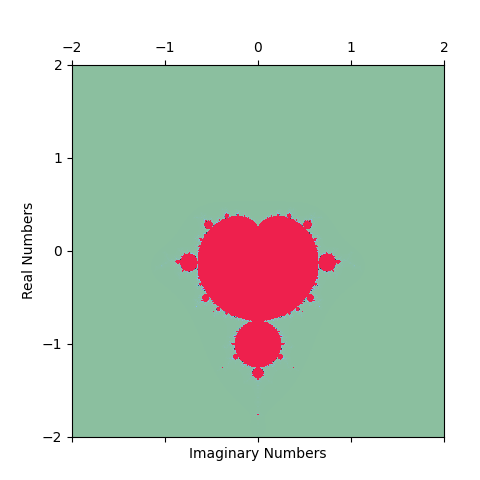

# Assignment 1
Estimating the area of Mandelbrot set with monte carlo integration

<center>
    
</center>
## Prerequisite
Python >3.10

## How to Run
Clone the project

```bash
  git clone https://github.com/nabilasiregar/stochastic-simulation
```

Go to the project directory

```bash
  cd stochastic-simulation
```

Run the main file
```bash
  python Engels_14947994_Sahrani_12661651_Siregar_1486305.py
```

**Note:** _we cannot rename the file to Engels_14947994_Sahrani_12661651_Siregar_1486305_Assignment1.py because git would treat it as a completely new file without the previous commit history and we do not want that because we need it to count contribution using git-fame_

Run the simulation
```bash
  python simulation.py
```

❗Running the simulation is computationally expensive and will take at least one hour. For convenience, we have provided the datasets in the 'data' directory. 

To reproduce the plots presented in our report run
```bash
  python plotting.py
```